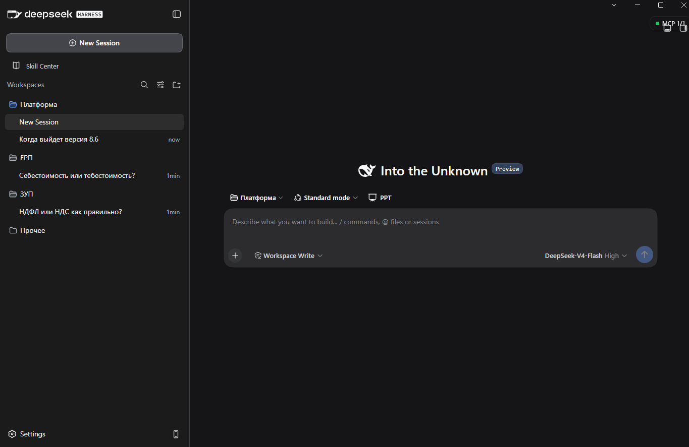
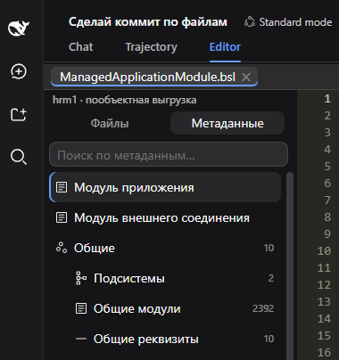
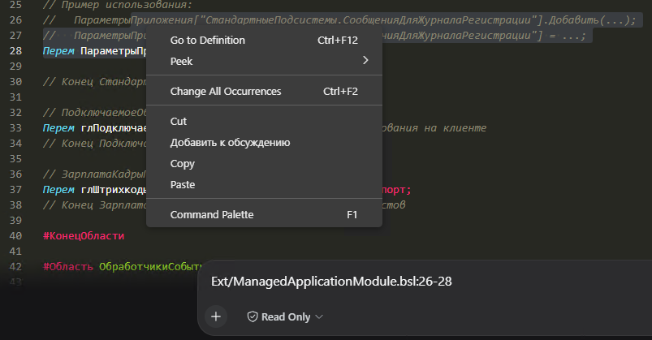
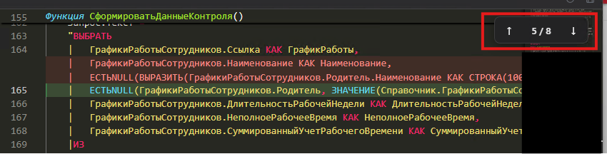
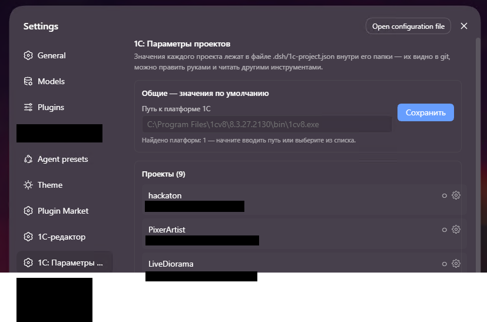

<h1 align="center">
  
  DSH для 1С
</h1>

<p align="center">
  <strong>Разные проекты. Одно окно.</strong><br />
  Готовая среда для разработки с ИИ-агентом DeepSeek Harness —<br />
  ставится одним <code>.exe</code>, без Node.js, CLI и ручной сборки плагинов.
</p>

<p align="center">
  <a href="https://mempemp.github.io/1C-DSH-promo/">Промо-сайт</a> ·
  <a href="https://github.com/Mempemp/DSH-1C-deskop-bundle/releases/latest">Скачать сборку</a> ·
  <a href="https://drive.google.com/drive/folders/1wEP8GXX6FFp6tcJ6eIWnG792o14BbkvR">Инструкция</a> ·
  <a href="#возможности">Возможности</a> ·
  <a href="#наши-плагины">Плагины</a> ·
  <a href="#сборка-из-исходников">Сборка</a> ·
  <a href="#благодарности">Благодарности</a>
</p>

<p align="center">
  
  
</p>

<p align="center">
  <a href="docs/images/promo-workspaces.png"></a>
</p>

Разработка на 1С, разбор рабочих вопросов, схемы и другие задачи — в одном приложении.
Создавайте рабочие области и переключайтесь между проектами, чтобы продолжать нужную работу.

## Возможности

### Рабочие области под каждый проект

Утром — доработка модуля 1С, затем — вопрос по ЕРП, схема процесса или подготовка документа.
Выберите нужный проект в боковой панели и продолжайте работу в его сессиях.

| Область | Задачи |
|---|---|
| **Платформа** | Разработка и код: дорабатывайте модули и разбирайтесь в возможностях платформы 1С |
| **ЕРП** | Рабочие вопросы: процессы, учёт и задачи по конкретной конфигурации |
| **ЗУП** | Свой круг задач: отдельные обсуждения по зарплате и кадровым процессам |
| **Прочее** | И не только 1С: тексты, схемы и исследования других тем |

### Всё в одной сборке

- **Привычное приложение** — десктопный интерфейс и пошаговый помощник установки: начните с одного `.exe`.
- **Навыки именно для 1С** — включённые правила и скиллы помогают агенту работать с задачами разработки.
- **Подключения без границ** — нужные MCP для 1С ставятся автоматически, свои MCP-серверы тоже можно добавить.
- **Веб-поиск для ИИ** — модели ищут материалы в интернете под ваши задачи.

## Наши плагины

### 01 — Редактор: ваш код, весь контекст рядом

Редактируйте BSL прямо внутри агента. Перемещайтесь по дереву метаданных и сразу видите, что изменилось.

- дерево объектов и модулей 1С;
- подсветка кода и просмотр изменений;
- отправка фрагмента кода в чат.

<p align="center">
  
  
</p>

<p align="center">
  <br />
  <sub>DSH CodeEditor BSL · реальные скриншоты плагина</sub>
</p>

Подробнее: [DSH-CodeEditor_BSL](https://github.com/Mempemp/DSH-CodeEditor_BSL)

### 02 — Параметры проекта: подключите базу, сохраните контекст

Данные подключения и авторизации для каждой информационной базы — в параметрах проекта, доступных инструментам агента.

- настройки подключения к ИБ 1С;
- выгрузка конфигурации в файлы;
- параметры для других инструментов.

<p align="center">
  <br />
  <sub>DSH 1C Project Properties · интерфейс плагина</sub>
</p>

Подробнее: [DSH-1CProjectProperties](https://github.com/Mempemp/DSH-1CProjectProperties)

### 03 — От кода к картине целиком

Попросите агента построить блок-схему: отдельную HTML-страницу с [Archify](https://github.com/tt-a1i/archify)
или Mermaid-диаграмму для документации. Объясняйте, обсуждайте, документируйте.

## Как начать

1. **Скачайте сборку** — со [страницы релизов](https://github.com/Mempemp/DSH-1C-deskop-bundle/releases/latest)
   или из [папки на Google Диске](https://drive.google.com/drive/folders/1wEP8GXX6FFp6tcJ6eIWnG792o14BbkvR).
2. **Установите** — запустите `.exe` и пройдите помощник установки.
   Если предыдущая версия уже стоит, установщик обновит её: диалоги, настройки, ключи и
   плагины, добавленные вами, останутся на месте.
3. **Подключите модель** — в [инструкции](https://drive.google.com/drive/folders/1wEP8GXX6FFp6tcJ6eIWnG792o14BbkvR)
   разобраны российские API-провайдеры и оплата в рублях.

Установщик не подписан сертификатом, поэтому Windows покажет предупреждение SmartScreen —
«Подробнее» → «Выполнить в любом случае». Автообновление выключено: новые версии скачиваются вручную
со страницы релизов.

## Что в комплекте

- **10 плагинов**: маркет плагинов [dshmarket](https://github.com/dsh-market/dsh-market),
  редактор BSL, параметры проектов 1С, RLM-инструменты для BSL,
  [Better Sidebar](https://github.com/omdsh-dev/DSH-better-sidebar),
  [Skill Explorer](https://github.com/zhu1090093659/dsh-web),
  [Archify](https://github.com/tt-a1i/archify),
  [modsearch](https://github.com/liustack/modsearch),
  [MCP-менеджер](https://github.com/wingsky-1/dsh-plugin-hub),
  русская локализация [dsh-russian-lang](https://github.com/GooDAnDReaDY/dsh-russian-lang);
- **12 навыков** для 1С и повседневных задач — работа с метаданными, хранилищем,
  выгрузка конфигурации в файлы ([ai_rules_1c](https://github.com/comol/ai_rules_1c));
- **правила** (`AGENTS.md`) для работы агента с 1С;
- **рантайм** `@deepseek-ai/dsh` внутри приложения — ставить Node.js и CLI не нужно.

Русский интерфейс предвыбран. Умные функции ввода (Smart UX) выключены по умолчанию —
включаются галочками в настройках плагина локализации.

## Сборка из исходников

Требования: Windows x64, Node.js LTS, npm.

```sh
npm install
npm run package:win     # dist/dsh-desktop-windows-x64-setup.exe
```

Проверки перед изменениями: `npm test`, `npm run typecheck`, `npm run build`.

Что внутри и как это устроено: [обзор проекта](docs/overview.md),
[архитектура](docs/architecture.md), [разработка](docs/development.md),
[релизный процесс](docs/release-runbook.md).

## Благодарности

Проект построен на открытых разработках, и мы благодарны их авторам:

- [DeepSeek Harness](https://github.com/deepseek-ai/deepseek-harness) — агентный рантайм;
- [DSH Desktop](https://github.com/dataelement/dsh-desktop) — десктопная оболочка (MIT), основа нашей сборки: мы развиваем её поверх апстрима, не переписывая рантайм, и добавляем свои плагины, навыки и установщик;
- [dsh-russian-lang](https://github.com/GooDAnDReaDY/dsh-russian-lang) — русская локализация интерфейса;
- [dsh-market](https://github.com/dsh-market/dsh-market) — маркет плагинов сообщества;
- плагины [wingsky-1](https://github.com/wingsky-1/dsh-plugin-hub),
  [liustack](https://github.com/liustack/modsearch),
  [omdsh-dev](https://github.com/omdsh-dev/DSH-better-sidebar),
  [tt-a1i](https://github.com/tt-a1i/archify),
  [zhu1090093659](https://github.com/zhu1090093659/dsh-web);
- навыки [comol/ai_rules_1c](https://github.com/comol/ai_rules_1c).

Сборка сделана командой «Реальная черемша» для хакатона 2026. Спасибо всем, кто пробует её
в работе и присылает замечания: продукт развивается вместе с вашими задачами.

## Лицензия

Сборка распространяется под [лицензией MIT](LICENSE), как и апстрим DSH Desktop.
DeepSeek Harness и остальные зависимости подчиняются своим лицензиям.
